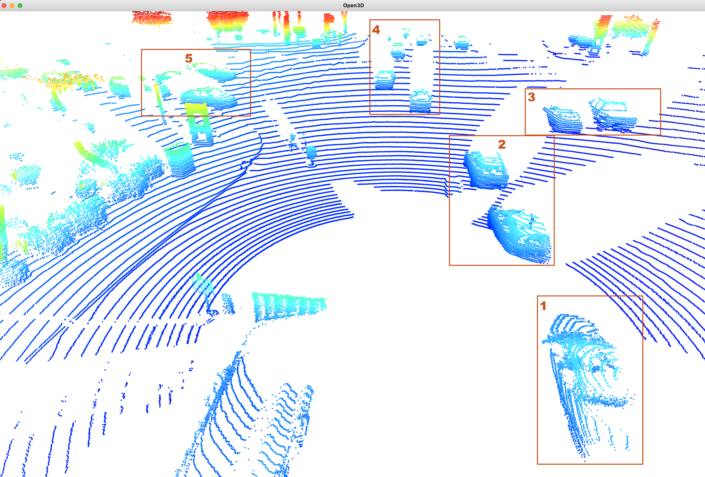
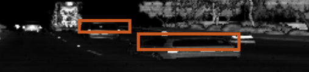

# Writeup: Midterm: 3D Object Detection

### 1. Find 10 examples of vehicles with varying degrees of visibility in the point-cloud

For this part of the write-up, I've added images and have mentioned numbers in the vehicle bounding boxes in the images. I've explained each of those bounding boxes with comments.

**Vehicles in the same lane in front of the the Waymo car**

1. This point cloud clearly shows a Pick-up truck along with an attached trolley behind it. Tyres of both the truck and the trolly can be seen easily as well as the rear point cloud clearly differs this truck from a normal car.

2. This is an example of a car with good visibility in front of the waymo car. Point cloud for the tyre shapes can be seen along with some empty space for the rear windshield.

3. These point clouds represent a truck and 2 cars that are a little farther than the waymo car. Although the visibility is bad for this frame of the scene, they get a better representation as our car gets closer to them.

4. These are the cars in the opposite row (explained later). Side view mirrors pop up prominently in the point cloud along with the front windshield.

**Vehicles in the same lane at the back of the the Waymo car**

This figure show the point cloud data that shows the scene behind the waymo vehicle.

1. In this image also, the bounding boxes with number #1, #2 and #3 are examples of vehicles with good visibility.

2. The truck with the #4 is not visible clearly. This might be due to the trees blocking the reflected lidar or the lasers not reaching the truck around most of the spots.

**Vehicles in the opposite lane**

1. This car is in the blind spot of the lidar due to it being too close to the waymo car. So it is only partially visible as compared to the other cars of that lane.

2. The #2 bounding box shows the nicely captured pickup truck and other cars from a far away parking spot. The features are very clearly visible as shown in the image that I've attached along with the point cloud.

**Intersection**

This image is from a later frame in the scene when the car reaches an intersection.

1. #1, #2, #3 and #4 show examples of some more clearly visible cars. Their roofs are nicely differentiated from their bonnets. Other features like pickup trucks's back as well as the windshields can be clearly seen.

2. The #5 box shows a few cars that are at the other side of the intersection which are not visible to the front camera. 1 car is clearly visible while the other 3 cars get in the blindspot of the lidar as the first car reflect most of the lasers.

### 2. Try to identify vehicle features that appear stable in most of the inspected examples and describe them

To work on this task, my main sources of information were the Intensity channel data (to get the reflection intensity visualized) and the camera images data to match the reflected lidar intensity with the actual vehicle features in the scene. These were the features that were consistent and distinguishable across the frames:

**Rear License Plates**

The license plates are usually made from a highly reflective material and this can be easily noticed in the scene as they are dominently bright and consistent at the back of the cars.

**Tail Lights**

After the license plates, tail light of the cars seem to be another dominent vehicle feature captured by the lidar. Again, the reflective material inside of the light is the major cause of this reflecting back a large amount of laser.

**Windshields**

Windshields caught my attention due to their interesting behaviour of not reflecting anything at all or only a negligible amount. This gives them a pitch black hole like effect in the intensity images. Car windows follow the same pattern

**Other (Non-Vehicle) features**

1. Throughout the frames, the fisheye lane markers along with signs on the street show up consistently with high intensity.
2. In the intersection scene, there are few people who have worn a retroreflective dress which show up with a very high intensity too.
